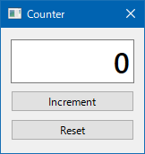
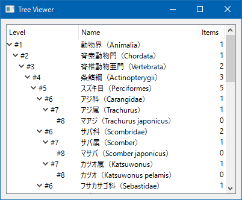
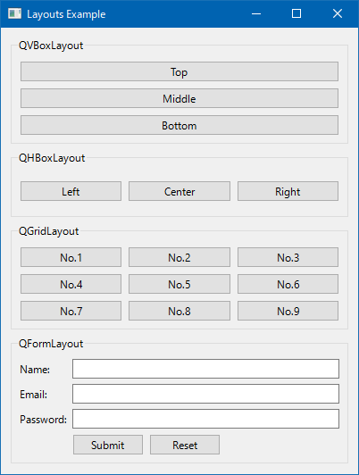
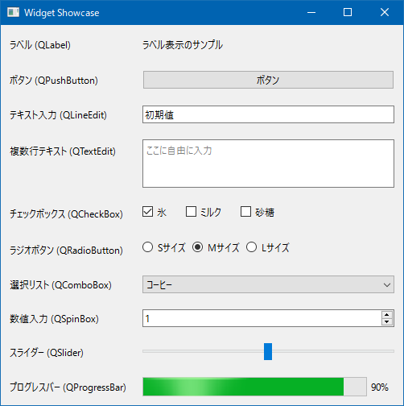

# practice-pyside

## セットアップ

事前に `rye` の導入が必要 ([rye 公式サイト](https://rye.astral.sh))。

プロジェクトルートで以下のコマンドを実行し、プロジェクトの依存パッケージをインストールする。

```sh
rye sync
```

## 実行方法

### カウンター (MVC モデルのサンプル)



```sh
python -m src.counter
```

### ツリー表示

`QTreeWidget`, `QTreeWidgetItem`



```sh
python -m src.tree_viewer
```

### 各種レイアウト

`QVBoxLayout`, `QHBoxLayout`, `QGridLayout`, `QFormLayout`



```sh
python -m src.layouts
```

### 各種ウィジェット

`QLabel`, `QPushButton`, `QLineEdit`, `QTextEdit`, `QCheckBox`, `QRadioButton`, `QComboBox`, `QSpinBox`, `QSlider`, `QProgressBar`



```sh
python -m src.widgets
```

## PySide6 の基本構文

### 1. アプリケーションの作成

```python
from PySide6.QtWidgets import QApplication

app = QApplication(sys.argv)  # アプリケーションオブジェクトを作成
```

### 2. ウィジェット（ウィンドウや部品）の作成

```python
from PySide6.QtWidgets import QWidget, QPushButton, QVBoxLayout

window = QWidget()  # ウィンドウ
button = QPushButton("Click Me")  # ボタン

layout = QVBoxLayout()
layout.addWidget(button)
window.setLayout(layout)
```

### 3. シグナルとスロット（イベント処理）

```python
def on_click():
    print("Button clicked!")

button.clicked.connect(on_click)  # ボタンがクリックされたときに関数を呼ぶ
```

### 4. ウィンドウの表示とイベントループ

```python
window.show()      # ウィンドウを表示
app.exec()         # イベントループ開始（アプリが終了するまで待つ）
```

## MVC モデルについて

MVC モデルでは「Model（モデル）」「View（ビュー）」「Controller（コントローラー）」の 3 つの役割に分けて設計する。

### Model（モデル）

- **データやビジネスロジックを管理する部分**
- アプリの状態（例：カウンターの値）や、その値を操作するメソッド
- 画面表示やユーザー操作には直接関与しない

### View（ビュー）

- **ユーザーインターフェース（UI）を担当する部分**
- モデルのデータを画面に表示する
- ユーザーからの入力（ボタン押下など）を受け取る部品を持つが、ロジックは持たない
- 例：ウィンドウ、ボタン、テキスト表示など

### Controller（コントローラー）

- **ユーザーの操作とモデル・ビューの橋渡しをする部分**
- ビューのイベント（ボタン押下など）を受け取り、モデルを操作し、必要に応じてビューを更新する
- ロジックの中心的な役割

### `counter.py` での例

- **Model（モデル）**
  `CounterModel`
  カウンターの値（データ）とその操作（`increment`, `reset_count`, `get_count`）のみを管理する

- **View（ビュー）**
  `CounterView`, `CounterLineEdit`
  ユーザーインターフェース（ウィンドウ、ボタン、表示用 LineEdit）のみを担当し、ロジックは持たない

- **Controller（コントローラー）**
  `CounterController`
  ビューのイベント（ボタン押下）を受け取り、モデルを操作し、必要に応じてビューを更新する
